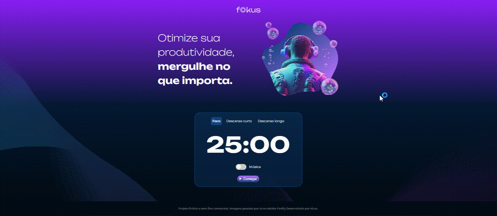

# Proyecto Fokus

## Descripción del Proyecto:

Este proyecto se realizó durante los cursos "Manipulación de Elementos DOM" y "Exploración de la Manipulación de Elementos y Almacenamiento local" de la capacitación "Desarrollo de Aplicaciones Web con JavaScript" en la plataforma Alura.

Este es un proyecto Front-end basado en datos proporcionados por un equipo de Diseño a través de la plataforma Figma. También se proporcionaron códigos HTML y CSS, el enfoque principal del curso fue la práctica del lenguaje de programación JavaScript, principalmente la parte de manipulación de elementos.

Fokus se inspira en la técnica Pomodoro, cuyo objetivo es mejorar actividades importantes. Básicamente consiste en concentrarse en una actividad durante 25 minutos ininterrumpidos y, tras ello, un breve descanso de 5 minutos, o un descanso más largo de 15 minutos.

La página tiene tres contextos diferentes:

* Enfocar;
* Corto descanso;
*Descanso prolongado.

El contexto de la página, así como sus respectivos elementos, cambian según la interacción del usuario, por ejemplo: imagen; color de fondo; efectos sonoros; etc.

En el primer curso se desarrolló la parte relativa a la estilización del contexto de cada página, adición de efectos de sonido y ajustes al botón play/pausa.

En el segundo curso se utilizó la aplicación creada en la primera parte para desarrollar nuevas funcionalidades para el proyecto. Se utilizó el concepto de Almacenamiento Local y cómo almacenar información en él para almacenar tareas proporcionadas por el usuario, por ejemplo. Esto se hizo para crear y actualizar la lista de tareas del usuario.

Además, se desarrollaron varias funcionalidades relacionadas con las tareas. El primero de ellos fue seleccionar la tarea que se está realizando actualmente y, tan pronto como se reinicie el temporizador de contexto de Focus, marcar la tarea como completada. También se implementó una forma de excluir de la lista sólo las tareas completadas o eliminarlas todas a la vez.

## :floppy_disk: Accediendo al Proyecto:

Se puede acceder a la versión final del proyecto en el siguiente enlace:

[Proyecto Fokus - Versión Final](https://projeto-fokus-zeta-one.vercel.app/)

## :computer: Tecnologias Utilizadas:

- `JavaScript`
- `HTML`
- `CSS`

> Status do projeto: :white_check_mark: Finalizado. :white_check_mark: